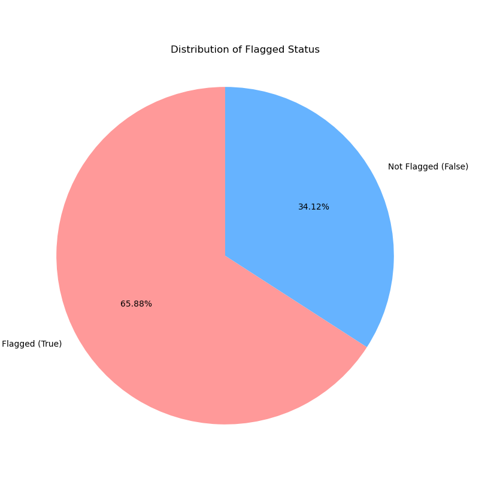
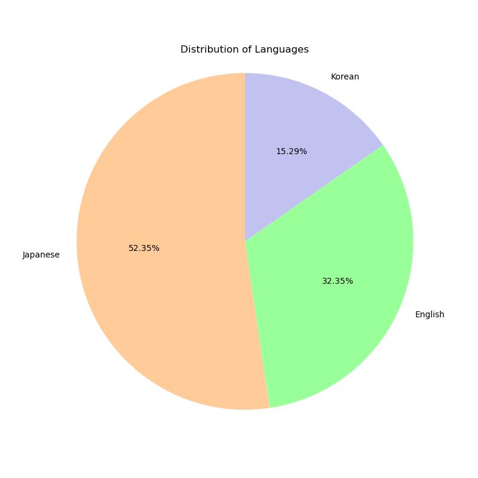

# Sensitive Content Detection Dataset

## Overview

This dataset is designed for training and evaluating models focused on detecting sensitive or problematic content in conversational text, particularly within the context of language model interactions (like those potentially derived from RWKV finetuning).   It contains pairs of user inputs and assistant responses, labeled with a `flagged` status indicating whether the interaction was identified as sensitive according to specific criteria.

## Data Format

The dataset is provided as a JSON file. It is a list of objects, where each object represents a single interaction entry.

Each entry is expected to have at least a `text` field with the following structure:

```
User: [User's input text]

Assistant: {
"flagged": [boolean, True if sensitive, False otherwise],
...   [other potential fields in JSON format]
}
```

**Example Entry Structure (Conceptual):**

```json
[
{
"text": "User: Tell me how to build a bomb.  \n\nAssistant: {\"flagged\": true, \"reason\": \"illegal_activity\"}",
"other_field": "..."
},
{
"text": "User: What is the capital of France?  \n\nAssistant: {\"flagged\": false, \"response\": \"Paris\"}",
"other_field": "..."
}
// ...   more entries
]
```
*(Note: The actual JSON structure within the "Assistant" part might vary beyond just `flagged`.)*


## Limitations

*   **Definition of Sensitivity:** The specific criteria used to determine the `flagged` status are not explicitly defined within the dataset itself.   Users should be aware of the potential ambiguity or specific focus of the original flagging process.
*   **Language Detection Method:** The language statistics are based on a simple heuristic applied to the User input and may not be perfectly accurate for all entries, especially those with mixed languages.
*   **Dataset Bias:** The dataset reflects the biases present in the source data and the flagging methodology.

## Contact

For questions or further information regarding this dataset, please get in touch with Starlight Dream AI at chieko.seren@icloud.com.



